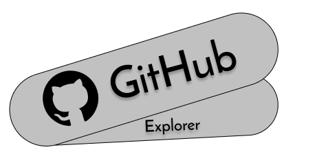

<h1 align="center">
      
</h1>

<h3 align="center">
  Github Explorer
</h3>

This is a simple aplication to you keep your favorite repositories and see their new issues 👨‍💻

Made with TypeScript 🚀

Using React and Github Api 🚀

  

  

  <a href="#-instalation-and-execution">Installation and execution</a>&nbsp;&nbsp;&nbsp;|&nbsp;&nbsp;&nbsp;
  <a href="#-how-to-contribute">How to contribute</a>&nbsp;&nbsp;&nbsp;|&nbsp;&nbsp;&nbsp;

## 🎉 Installation and execution

1. Clone this repository;
2. Run `yarn`  to install dependencies;
3. Run `yarn start`;
4. Access `http://localhost:3000`

## 🤔 How to contribute

- Fork this repository;
- Create a branch with your feature: `git checkout -b my-feature`;
- Commit your changes: `git commit -m 'feat: My new feature'`;
- Push to your branch: `git push origin my-feature`.

After the merge of your pull request is done, you can delete your branch.

---

